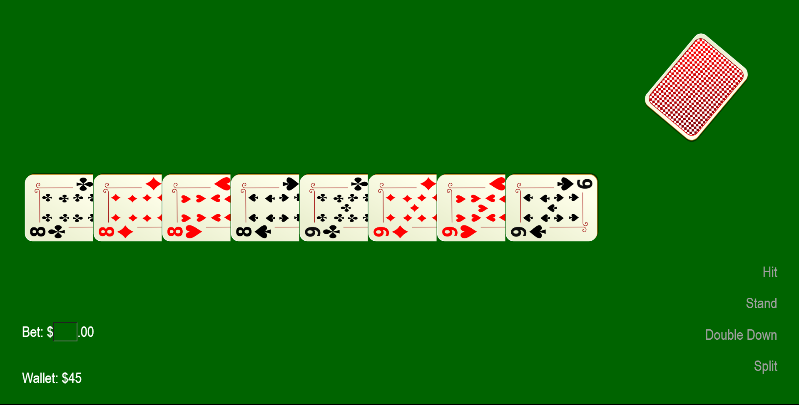

# **Wild West Blackjack Simulator**
## **Site Overview**
Blackjack, which is formerly known as Vingt-Un, French for 21, is traditional casino game. The aim of the game is to draw cards to earn a score as close to 21 without going higher than 21. All players are against the dealer, who simultaneously plays against all other players with their single hand. Whilst I have never played an actual game of Blackjack to win money, I have always playing the game at University with my friends. Wanting to challenge myself, I decided that I would not only make a win/lose game, but one that also had a witty dealer in a Western setting. This simulator is not intended to encourage, fuel or give way to gambling, but rather to let people enjoy a classic game that gives off the Wild West vibe  

​

## Table of contents:
1. [**Site Overview**](#site-overview)
1. [**Planning stage**](#planning-stage)
    * [***Target Audiences***](#target-audiences)
    * [***User Stories***](#user-stories)
    * [***Site Aims***](#site-aims)
    * [***Color Scheme***](#color-scheme)
    * [***Typography***](#typography)
1. [**Features**](#features)
    * [***Bets and Inputs***](#bets-and-inputs)
    * [***Player Commands***](#player-commands)
    * [***Insurance Phase***](#insurance-phase)
    * [***Main game***](#main-game)
    * [***Buying Back In***](#buying-back-in)
1. [**Future-Enhancements**](#future-enhancements)
    * [***Surrendering***](#surrendering)
    * [***The Shuffle Function***](#the-shuffle-function)
1. [**Testing Phase**](#testing-phase)
    * [***Responsiveness***](#responsiveness)
    * [***Functionality***](#functionality)
    * [***Verification***](#verification)
1. [**Bugs**](#bugs)
    * [***Straights in a straight line***](#straights-in-a-straight-line)
    * [***Repeated Functions***](#repeated-functions)
1. [**Deployment**](#deployment)
1. [**Tech**](#tech)
1. [**Credits**](#credits)
    * [**Honorable mentions**](#honorable-mentions)
    * [**Content**](#content)
​
## **Planning stage**
### **Target Audiences:**
* Fans of Blackjack
* Wild West enthusiasts
​
### **User Stories:**
* As a user, I want to practice against a machine before I play the game in real life.
* As a user, I want to be able to play my favourite game whenever I want.
* As a user, I want to learn how to play Blackjack.
​
### **Site Aims:**
* To provide all users with a fun game.
* To provide users with an expereience that is reminiscent of the Wild West.
​
### **Color Scheme:**
* For my main colour, I chose a dark green, #006400, since it gives off the vibe of an actual Poker table, and in order for it to stand out on a green field, I made the dealer's speech bubbles #fbc304. Whilst adobe colour suggested complementary colors such as purple, #4A0563, or dark red, #631305, I felt these colours were too rich and luxurious, so I decided on a lighter gold colour. 

​
### **Typography**
* Of the fonts that were available to me, I decided that Rye, and Smokum were the most asthetically fitting fonts as they both has connections a Wild West setting.
* All fonts were sourced from Google fonts, as stated in the credits.

​
## **Features**

### *Bets and Inputs*
* The input field accepts numbers only, and can be submitted either by pressing the submit button, or by pressing the enter key by making use of an event horizon.
* The bet keeps track of how many "dollars" the player has and this dictates how much they can bet and how much they will earn when they win.
* The bets, input field and button are all responsive.

​
### *Player Commands*
* At the bottom right of the screen, when it is the player's turn, they will be able to Hit, Stand or Double Down.
* Hitting will execute a function tht draws a card from the deck and into the dealer's hand.
* Standing will end the player's turn and pass on to the next CPU player.
* Doubling Down will double the player's bet and let them draw only one more card, before freezing the Player Commands section.

* When it is the player's turn, the buttons will turn white, and the 'not allowed' cursor will be replaced with a regular cursor.

### *Insurance Phase*
* If the dealer's faceup card is a ten or higher, the player user will be offered a choice on whether to buy insurance or not.

### *Main Game*
* Each round involves a betting, playing and victory stage.
* Whilst the victory of the additional CPUs on the side of the screen mean nothing to the player, whether the dealer's cards are higher or lower than the player's will determine if they win that particular round, before continuing on.

* If a player or CPU goes bust or stands, the dealer will anounce that before moving on to the next player.

### *Buying Back In*
* Should the player lose all of their fictional money in this game, the dealer will offer them a chance to buy back in.

​

## **Future-Enhancements**
​
### *Surrendering*
* In addition to buying insurance, the player is sometime given the choice to take half their bet back and surrender if they believe that they will lose.
* This option could be added during the insurance phase by giving the player a third option, following PLAY and INSURE.

### *The Shuffle function*
* Traditionally, in Blackjack, the cards are not reshuffled back into the draw pile until the draw pile is empty. This is not the case in my simulator however, as I could not figure out how to create a function that could check the number of cards in the draw pile before deciding that more cards are necessary to draw another card or play another round.

## **Testing Phase**
​
### *Responsiveness*
* I used my ASUS TUF DASH F15 to write and test this simulator during and used Chrome Dev Tools to test for initial responsiveness. 
* Initially, the cards were not able to be moved without altering the position in relation to each other, but by using media queries, I was able to assign some fixed values to the img elements which fixed this issue.
* After the intial testing was complete, I used my iPhone 8+ to test whether this application could be run on mobile devices, both in landscape and in portrait view.
* I succesfully tested my website on Google, Safari, Firefox, and Microsoft Edge. Whilst the arrow keys on the number input field appear on the Firefox browser, there is no other change to the website in any other way.

### *Functionality* 
* I tested each function by making sure console.logs were successfully feeding back to me.
* I ran through 5 the round loops for several hours ironing out any mistakes or errors.
* I added a submit button upon realising that touch screen users would have no way of submitting their bets and ultimately starting the game. I added a new function, as well as some HTML and CSS code to make up for this design flaw.
* I checked with pen and paper to ensure that every single win/loss possibility was accounted for and waited for those conditions to be met so I could ensure no rare condition would occur.

### *Verification*
* I tested the HTML code on the w3c validator, and ironed out all the issues that were reported back.

* The w3c validator reported no issues with my CSS code.

* I tested my site on the Google dev tools "lighthouse" function.

​

* And finally, I ironed out all flagged errors in my JS code using JSHint.

* The function collect which the JSHint claims isn't being called is being called via a clickme attribute on the submit button element.

## **Bugs**

### Straights in a straight line 
* When I ran the beginRound function for the first time, there were two bugs to do with how the cards were being pushed.

* The first problem was that the cards were being randomly selected, but the following cards would always be the next one in the array. This was because the array where the card images were collected from were all ordered.

* Fixing this problem was relatively easy, all that had to be done was for a random number to be selected every time the function was called rather that when the DOM loaded up.
* As for fixing the issue with the cards being ordered in a straight line, this issue was fixed by declaring four separate "deal" functions which would send each player's cards to their correct hands.

### Repeated functions
* Halfway through development, the CPU1 player would often be dealt more than one card at a time, which would then cause a chain reaction and cause all other players to draw more cards than they required, making it very unlikely for any player to beat the dealer.

* It took me several days and with some help, but I had figured out that the insurancePhase function had been called an additional time in the JS code, meaning that two rounds would be executed simultaneously and would often merge together.
* As soon as this single of code had been removed, the code started to flow normally again. 

## **Deployment**
* I deployed the page on GitHub pages via the following procedure: -
​
1. From the project's [repository](https://github.com/L0rdGabbers/blackjack-simulator), go to the **Settings** tab.
2. From the left-hand menu, select the **Pages** tab.
3. Under the **Source** section, select the **Main** branch from the drop-down menu and click **Save**.
4. A message will be displayed to indicate a successful deployment to GitHub pages and provide the live link.

* You can find the live site via the following URL - [live webpage](https://l0rdgabbers.github.io/blackjack-simulator/)

​
## **Tech**
* The coding languages used to create this site were HTML, CSS, and JS
​
​
## **Credits**

### **Honorable mentions**
* Thank you to Richard Wells, for making me feel really proud of my first ever implementation of JavaScript, and for helping me find that single darn line of code mentioned earlier.
* Thank you to my family, for putting up with me sitting in another room for hours on end during the easter holidays whilst I wrote this readme.file.
* Thank you to Ziwei Zhou for checking up on me in the middle of the night to see if I was ok.
* Thank you to Red Dead Redemption II for teaching me the rules of Blackjack.
​
### **Content:**
* The code used to set the points value of the Aces after a player had gone bust was of the courtesy of Richard Wells, although I may have tweeked it a little.
* The code used to determine whether a CPU should hit or not was of the courtesy of Richard Wells. 
* Rye and Smokum font was provided sourced from google fonts: https://fonts.google.com
* The card images were sourced from http://www.freestockphotos.biz/photos.php?c=all&o=popular&s=0&lic=all&a=all&set=oca-dLlj2sa